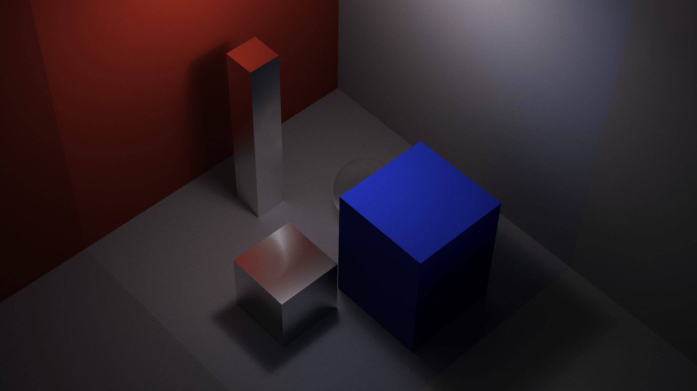
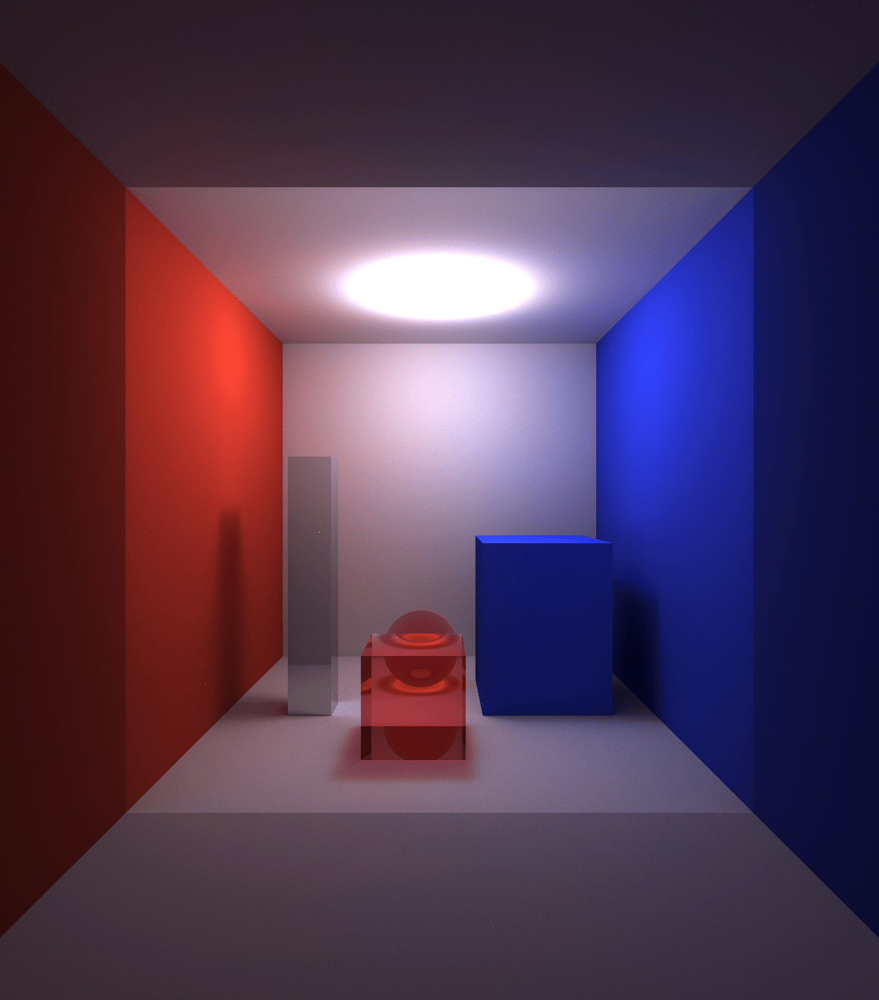
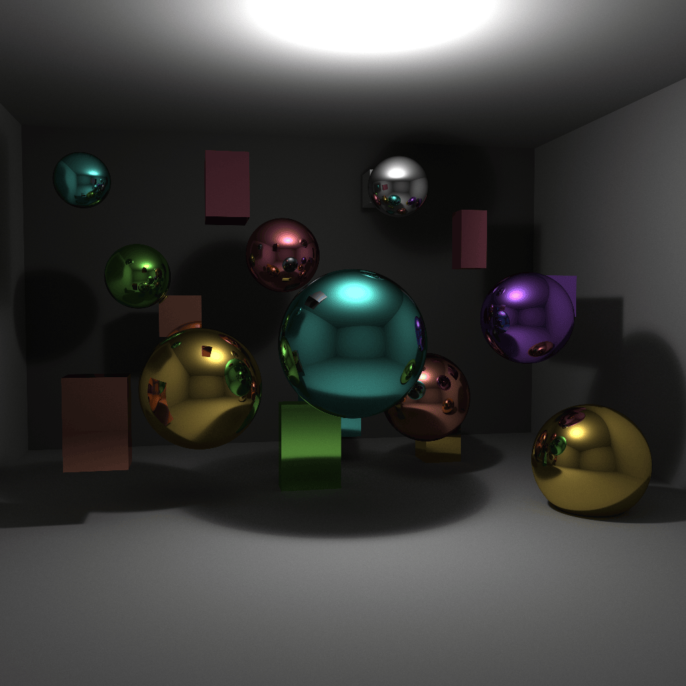
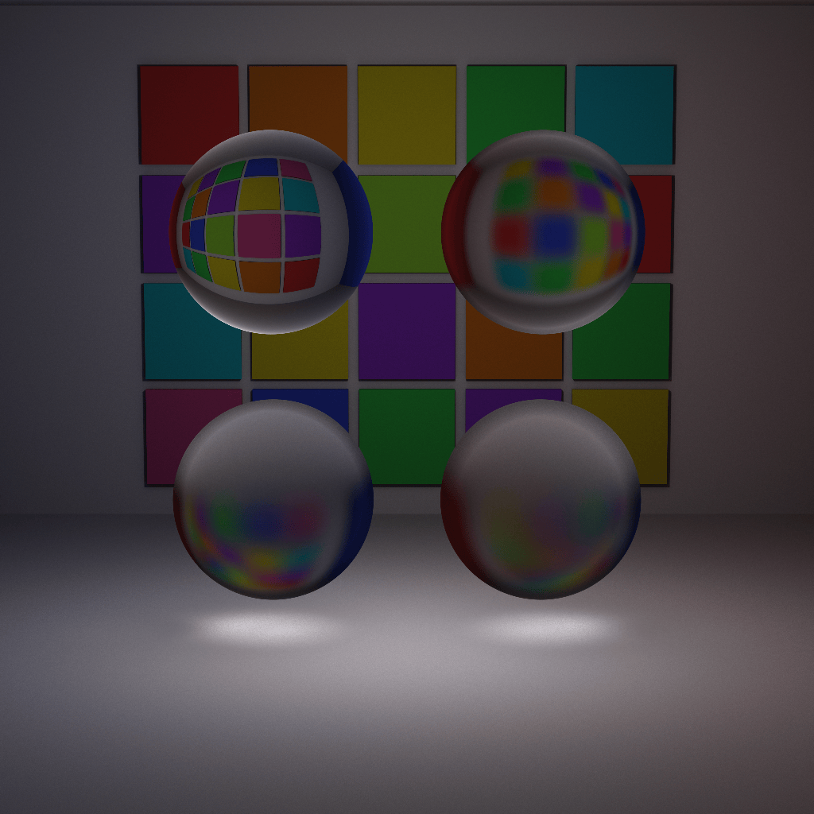
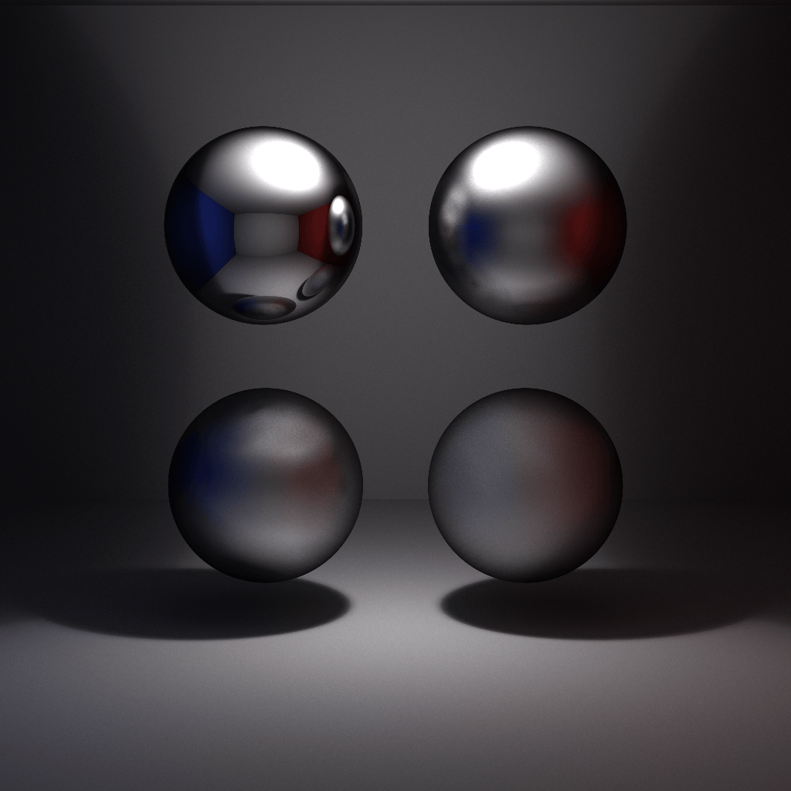

# tracey_rt — Vulkan GPU Raytracer



A real-time GPU raytracer built with Vulkan compute shaders. Supports physically based materials, area lights, texture mapping, mesh loading, and an interactive camera — all rendered live on the GPU.

## Gallery

<table>
  <tr>
    <td align="center"><br/>Path tracing with global illumination</td>
    <td align="center"><br/>Colored metallic materials</td>
  </tr>
  <tr>
    <td align="center"><br/>Glass with roughness (blurry refraction)</td>
    <td align="center"><br/>Mirror roughness variation</td>
  </tr>
</table>

## Dependencies

### Linux

Debian/Ubuntu:
```bash
sudo apt install cmake libglfw3-dev libglm-dev libspdlog-dev vulkan-tools libvulkan-dev glslang-tools
```

Arch:
```bash
sudo pacman -S cmake glfw glm spdlog vulkan-tools vulkan-icd-loader glslang
```

### macOS
```bash
./scripts/InstallBrewDependencies.sh
```
Installs `cmake`, `glfw`, `glm`, `spdlog`, and `vulkan-tools` via Homebrew.

### Windows
```bat
scripts\InstallVcpkgDependencies.bat
```
Clones and bootstraps vcpkg, then installs `glfw3`, `glm`, and `spdlog`.

**Additional requirements on all platforms:** CMake 3.20+, a C++20 compiler, and a Vulkan-capable GPU with up-to-date drivers.

## Building

### macOS (Xcode)
```bash
./scripts/BuildMacOS.sh
```

### Linux
```bash
./scripts/BuildLinux.sh
```

### Windows (Visual Studio 2022)
```bat
scripts\BuildWindows.bat
```

Clean builds (wipes `bin/` and `build/` first) are available as `CleanBuildMacOS.sh`, `CleanBuildLinux.sh`, and `CleanBuildWindows.bat` in the same `scripts/` folder.

The binary is output to `bin/tracey_rt` (or `bin/tracey_rt.exe` on Windows).

## Usage

```
Usage: tracey_rt <arguments>
 * using no arguments runs tracey_rt in interactive mode
--input, -i                      <filename>          set the input scene
--dim, --dimension, -d, --size   <width> <height>    set the image dimensions
--output, -o                     <filename>          set the output filename
--samples, -s                    <samples>           set the sample count
--non-interactive                                    run in non-interactive mode
--bounces                        <n>                 set the max ray bounces
--help, -h                                           display this help text
--version                                            display the version
```

Scene files are JSON and live in `scenes/`. Example:

```bash
./bin/tracey_rt --input scenes/default.json --samples 256
```

Run without arguments to launch the interactive viewer with live rendering and camera controls.
